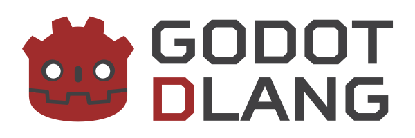
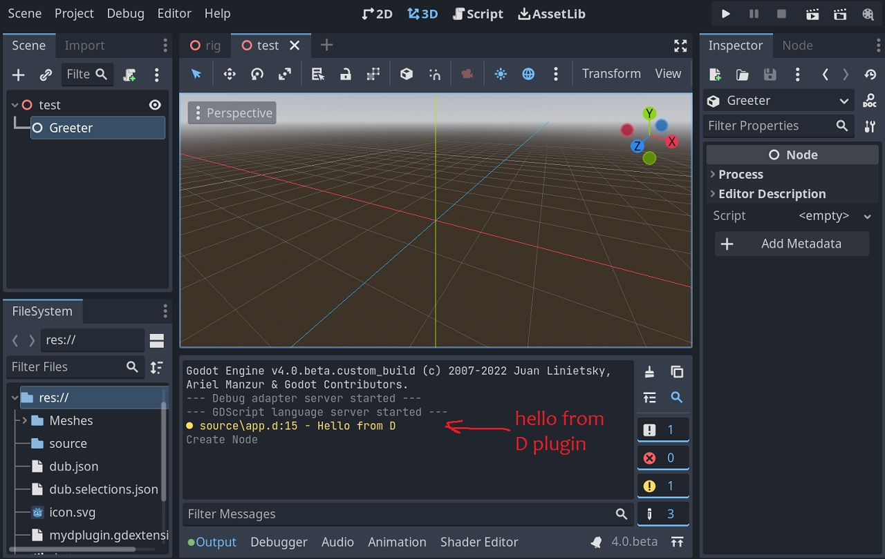

[](https://github.com/godot-dlang/godot-dlang)

# Godot-DLang

D language bindings for the [Godot Engine](https://godotengine.org/)'s
[GDExtension API](https://github.com/godotengine/godot-headers).

Originally a fork of [godot-d](https://github.com/godot-d/godot-d)

**WIP**: These bindings are still under development. Until v1.0.0, expect
breaking changes, bugs, and missing documentation. Please report any issues and
confusing or undocumented features on the GitHub page.

## Usage

### Dependencies
- D compiler:
  - [DMD 2.096+](https://dlang.org/download.html#dmd) or
  - [LDC 1.26.0+](https://github.com/ldc-developers/ldc#from-a-pre-built-package)
- [DUB](https://dub.pm) package/build tool (usually included with both compilers)

Before you start please keep in mind that this is purely experimental unstable volatile WIP project not officially maintained (or maintained at all) intented for those brave people who would like to try D and Godot.

In no situation do not use it to ship your product, doing so of course is possible but by no means the author is responsible for the consequences.

In order to proceed you will need D compiler (`dmd` or `ldc2`) with `dub`, `git`, and `godot editor` (x64 version assumed)

### Install godot-dlang using dub

This will download and cache dub package
- run `dub fetch godot-dlang`

Proceed to (Creating dub project)[#creating-dub-project] for adding it to your D project.

### Manually building (advanced)

_Normaly one would use dub package, this section is for advanced users who would like to develop or hack godot-dlang_

- clone git repo `git clone https://github.com/godot-dlang/godot-dlang.git`
- switch it to master branch `git checkout master`
- use dub local project version lock file `dub.selections.json` to specify where to look for your local copy

> Note that if you have strange errors in `dub run` you might have godot-dlang cached in dub, you might need to remove it by using `dub remove godot-dlang`
>

### Generating Godot Bindings
- download godot beta4 editor and place it in somewhere like `C:\godot`
- step into that directory and open terminal
- generate script API information with command `godot.exe --dump-extension-api`
- run binding generator (-j tells where to look for script api and -o tells to overwrite any existing bindings) `dub run godot-dlang:generator -- -j extension_api.json -o`

> This step is one time process, though you would need to re-generate API and bindings for every godot release

### Creating Godot project
- open godot editor, and create a new project in some known location like `C:\godot\mycoolgame`
- open it now and let godot do initial loading

### Creating dub project
- open your newly created project in terminal
- run `dub init`, make sure to give it a name for example `mydplugin`
- add godot-dlang master dependency `dub add godot-dlang@~master`
- (optional) (Windows) if you use `ldc2` as compiler, then add `"dflags-windows-ldc": ["-dllimport=defaultLibsOnly"]` to your `dub.json`, or you will have linker errors
- open up `dub.json` and add `"targetType": "dynamicLibrary",` after `authors` field
your dub.json file should look like this now:

__dub.json__:
```json
{
    "authors": [
        "Godot-DLang"
    ],
    "targetType": "dynamicLibrary",
    "dflags-windows-ldc": ["-dllimport=defaultLibsOnly"],
    "copyright": "Copyright © 2022, Godot-DLang",
    "dependencies": {
        "godot-dlang": "~master",
    },
    "description": "A minimal D application.",
    "license": "proprietary",
    "name": "mydplugin"
}
```
- do a test build `dub build`, you might see some warnings but that's ok

### Creating your first D script
- rename `source/app.d` file into something like `source/greeter.d`
- open `source/greeter.d` in your favorite text/code editor and add following content:

__source/greeter.d__:
```d
import godot;
// import godot.api.script; // for GodotScript!
// import godot.api.register; // for GodotNativeLibrary
// import godot.string; // for gs!

import godot.node;

// minimal class example with _ready method that will be invoked on creation
class Greeter : GodotScript!Node {
    // this method is a special godot entry point when object is added to the scene
    @Method 
    void _ready() {
        // 'gs' is a string wrapper that converts D string to godot string
        // usually there is helper functions that takes regular D strings and do this for you
        print(gs!"Hello from D"); 
    }
}

// register classes, initialize and terminate D runtime, only one per plugin
mixin GodotNativeLibrary!(
    // this is a name prefix of the plugin to be acessible inside godot
    // it must match the prefix in .gdextension file:
    //     entry_symbol = "mydplugin_gdextension_entry"
    "mydplugin", 

    // here goes the list of classes you would like to expose in godot
    Greeter,
);
```
- build plugin again `dub build`, in some rare cases you might do a full rebuild by adding `--force` switch, build should be ok

> You would need to build your plugin every time you have modified the code in order to see changes

> Currently AFAIK there is no way to unload/reload GDNativeExtension, because of that on Windows it will prevent rebuilding plugin until you close the editor!

### Register GDNativeExtension
- Currently there is no UI for that AFAIK, so lets do that manually
- create a file in your godot project root called `mydplugin.gdextension` and fill with following content:

__mydplugin.gdextension__:
```
[configuration]

entry_symbol = "mydplugin_gdextension_entry"

[libraries]

linux.64 = "libmydplugin.so"
windows.64 = "mydplugin.dll"
```

> Note that entry_symbol should match class registration in D inside of `GodotNativeLibrary` declaration

### Use D scripts in godot
- If you still have godot editor open reload project by using main menu `Project->Reload Current Project`
- In editor now create an empty `3D Node` scene
- Select root object and attach new `Node` entity, navigate and pick `Greeter` class
- As soon as it gets added to the scene you should see Hello message in log in the panel below.



### Extend as you wish!
- remember that there still might be some bugs, sometimes confusing, sometimes blocking your progress, and sometimes even missing features

Enjoy your new game!

### Automatic reloading of native extension

_This feature is experimental_

Copy `addons/reload-d` editor plugin to your godot project `addons` folder and enable `reload-d` plugin in `Project -> Project Settings -> Plugins` menu.

Next update your `dub.json` project and add following lines, this will automatically tells editor to unload library and then load it again after build.

```json
"preGenerateCommands": ["dub run godot-dlang:reloader -- --action unload -e $DUB_TARGET_NAME"],

"postGenerateCommands": ["dub run godot-dlang:reloader -- --action load -e $DUB_TARGET_NAME"],
```

### Godot API
Godot's full [script API](http://docs.godotengine.org/) can be used from D:  
- `godot` submodules contain container, math, and engine structs like `Vector3` and `String`.
- Other submodules of `godot` contain bindings to Godot classes, auto-generated from the engine's API. These are the native classes scripts can be attached to.
- These bindings use camelCase instead of snake_case.
    ```D
    // Change window to fullscreen example:
    // GDScript
    OS.set_window_fullscreen(false)

    // Would be:
    // D
    OS.setWindowFullscreen(false);
    ```
- D code should use D naming conventions (PascalCase for classes, camelCase for properties and methods). 

## Versioning

The GDExtension API should be binary-compatible between Godot minor versions as in SemVer convention, so a D library
built for Godot v4.0.0 should work with any v4.0.x versions but not guaranteed to work with v4.1.0 or later. 

D bindings must be generated for your target Godot minor release version
(`godot.exe --dump-extension-api`).

Extension version properties can be checked to prevent newer functions from
being called with older Godot binaries. For example:
```D
import godot.apiinfo; // contains version information about bindings

if(VERSION_MINOR > 0) useNewGodotFunctions();
else doNothing();
```

License
-------
MIT - <https://opensource.org/licenses/MIT>

Github Links
-----
- GitHub repository - <https://github.com/godot-dlang/godot-dlang>
- GDExtension repository - <https://github.com/godotengine/godot-headers>
- C++ bindings these are based on - <https://github.com/godotengine/godot-cpp>
- D bindings these are based on - <https://github.com/godot-d/godot-d>

Links
-----
- Godot Engine - <https://godotengine.org>
- D programming language - <https://dlang.org>
